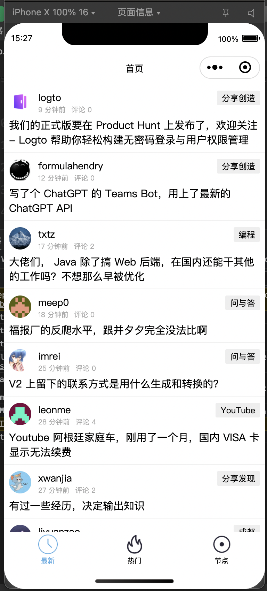
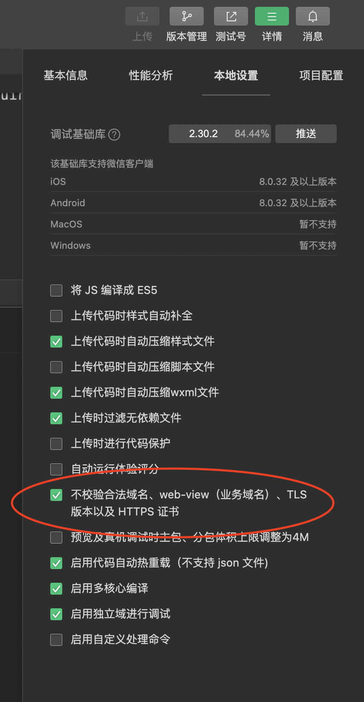

# v2ex-js-css-vue2

### 1. Framework: 
- Vue2
- CSS
- Javascript
- Taro
- Vuex

### 2. wxapp 需要设置代理

### 3. Run in localhost
- `yarn install`
- `yarn run dev:weapp`
- Import in WX tool
- set proxy

### 3. Demo

### 4. 小程序真机调试request:fail url not in domain list？

